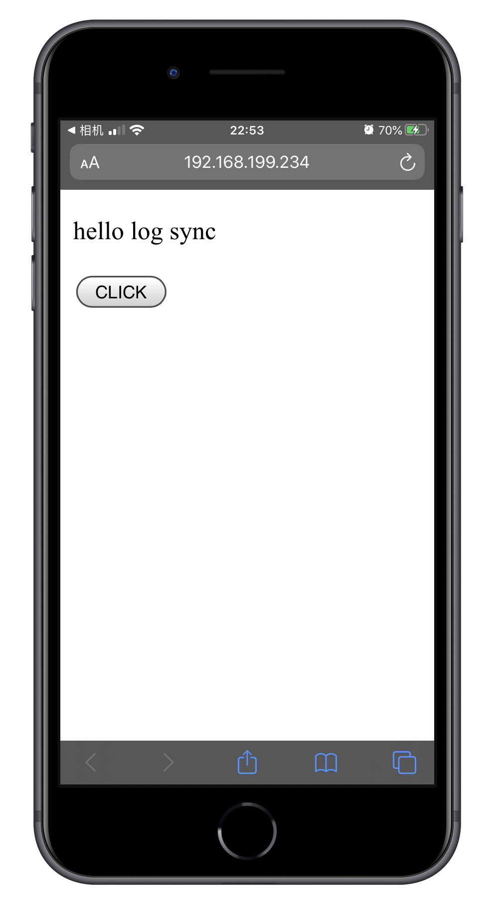
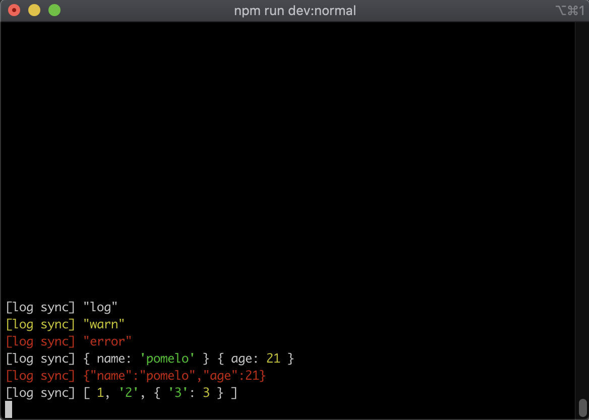

# Overview

Copy your log from browser to terminal.




# Getting started

## 1. Install log-sync via npm

```bash
$ npm install web-log-sync --saveDev
```

## 2. Add client script in your html

```html
<script src="path/to/dist/log-sync.min.js?prefix=[log sync]"></script>
```

## 3. Add **log-sync** command in you npm scripts

```bash
$ log-sync & npm run dev
```

# License

log-sync is available under the MIT License.